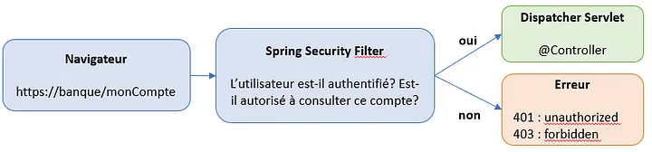

# TUTORIEL SUR LE DEVELOPPEMENT D'UNE APPLICATION WEB AVEC SPRING BOOT

**Une application web (API RestFull) sécurisée (https) avec gestion de l'authentification des utilisateurs et stockage des données dans une BDD.**

## 1- Spécificités de l'application todolist

Permet la gestion de taches à effectuer 

Chaque tache est constituée :
- 1 titre, 
- 1 commentaire, 
- 1 date de création, 
- 1 date de mise à jour
- 1 référence (clé etrangère) à un utilisateur


L'utilisateur est identifié par :
- 1 date de création,
- 1 date de mise à jour
- 1 nom
- 1 prénom
- 1 pseudo
- 1 mot de passe

L'utilisateur pourra créer, lire, modifier ou supprimer une tache


## 2- Initialiser et configurer le projet

### 2.1- Initialiser le projet avec le générateur https://start.spring.io/

#### 2.1.1- Paramètrer le projet
- Project: maven
- Language: Java
- Spring Boot: dernière version non snapshot
- Project Metadata
   - Group: com.ricou
   - Artifact: api.todolist
   - Name: api.todolist
   - Description: Api ToDoList project for Spring Boot
   - Package name:
   - Packaging: Jar ou War un fichier WAR (pour Web application Archive) est un fichier JAR utilisé pour contenir un ensemble de JavaServer Pages, servlets, classes Java, fichiers XML, et des pages web statiques (HTML, JavaScript…), le tout constituant une application web.
   - Java (version) : 17
   - 2017118

Les Paramètres sont stockées dans le fichier pom.xml à la racine du projet.


#### 2.1.2- Ajouter les dépendances
- Spring Web Web : Build web, including RESTful, applications using Spring MVC. Uses Apache Tomcat as the default embedded container.
- Lombok Developer Tools : C'est une bibliothèque Java qui aide à réduire le code et éviter les répétitions comme les getters, setters, etc.
- Spring Data JPA SQL : Utiliser Spring Data et Hibernate pour persister les données dans les magasins SQL avec l'API Java Persistence.
- Spring Boot DevTools Developer Tools : Fournit des redémarrages rapides des applications, LiveReload et des configurations pour une expérience de développement améliorée.
- OAuth2 Client Security : Intégration de Spring Boot pour les fonctionnalités du client Spring Security OAuth2/OpenID Connect. (cas d'un "login with Google" par exemple)
- Spring Security Security : Cadre d'authentification et de contrôle d'accès hautement personnalisable pour les applications Spring.
- MySQL Driver SQL : Pilote JDBC pour MySQL.


## 3- STRUCTURE DU PROJET MVC


Ajouter les dossiers suivants
- Controller
- Services
- Model
- Repository

## 4- Charger le projet (install dependencies, build, run)

### 4.1- Ouvrir IntellJ

### 4.2- Configuration du serveur web (tomcat)

Spring Boot incluent par défaut un serveur Web intégré préconfiguré, adresse et port du serveur 8080 par défaut.

Allez dans `ressources\application.properties`

````
server.port=9000
# server.address=my_custom_ip
logging.level.org.springframework.boot.web.embedded.tomcat=INFO
````

Ce fichier de configuration peut-être converti en fichier au format `yaml` (indentation des sous clé / valeurs)

### 4.3- Configuration de Maven (install dependencies, build, run)

Edit configurations... 

-> clique sur **+** Add new configuration `maven`


-> Parameter `clean package -f pom.xml`

**Ou je compile en sélectionnant :**

Lifecycle et sélectionner `clean` et `package` avec la touche `ctrl`


**Ou encore avec la touche maven "_m_"**

Execute Maven Goal

`mvn clean package`

### 4.4- Démarrer l'application avec Spring Boot Security

Spring Boot Security repose sur 2 principes :
- L’authentification : celui qui utilise l’application doit être identifié par un couple username/password.
- L'autorisations : tous les utilisateurs n’ont pas nécessairement accès aux mêmes fonctionnalités.

Spring Boot nous fournit donc un mot de passe par défaut en ajoutant Spring Security au classpath de notre application, 
Spring instaure une configuration par défaut, 
désormais pour accéder à notre application nous aurons besoin d’un User et d’un mot de passe.

Cette interaction est orchestrée par la Dispatcher Servlet de Spring, 
qui permet d’adresser les requêtes aux différents controllers de l’application. 

En résumé, Spring Security ne fait qu’ajouter des traitements à cette orchestration, par le biais de Servlet Filters. 

**L’ensemble des Servlet Filters constitue la Filter Chain de Spring Security**.



Cliquer sur la flèche verte en haut a droite `"Run api.todolist"` pour démarrer l'apllication.

Accèder à la page web à l'adresse suivante : [http://localhost:9000](http://localhost:9000)

Le routeur interne nous redirige automatiquement vers la page login via la soumission de formulaire d’authentification car nous ne somme pas authentifié.

DefaultLoginPageGeneratingFilter : construit une page d’authentification par défaut, à moins d’être explicitement désactivé. C’est pour cette raison qu’une page de login apparaît lors de l’activation de Spring Security, avant même que le développeur ne code une page personnalisée.

UsernamePasswordAuthenticationFilter : analyse une soumission de formulaire d’authentification, qui doit fournir un couple username/password. Ce filtre est activé par défaut sur l’URL /login.


Username : `user`

Password : Celui afficher dans la console (run) : Using generated security password: d1e8c588-10ca-48f0-9f95-550355fce7fb


Par defaut spring boot security forunit une protection csrf sur les formulaires

CsrfFilter : applique une protection contre les attaques de type Cross-Site Request Forgery en utilisant un token, usuellement stocké dans la HttpSession. Il est souvent demandé aux développeurs d’invoquer ce filtre avant toute requête susceptible de modifier l’état de l’application (usuellement les requête de type POST, PUT, DELETE et parfois OPTIONS).


Requête envoyée au serveur aprés soumission du formulaire d'authentification
- username
- password
- jeton crsf


Le serveur vérifie si l'utlisateur est authentifié puis envoie un cookie de session contenant l'identifiant.

Chaque fois que l'utilisateur enverra une requête au serveur, le cookie de session sera automatiquement transmis au serveur qui pourra authentifier l'utilisateur.

**UsernamePasswordAuthenticationFilter** : analyse une soumission de formulaire d’authentification, qui doit fournir un couple username/password. Ce filtre est activé par défaut sur l’URL /login.


Ce message d'erreur signifie qu'il n'exite pas de page web a renvoyer.


pour en créer une dans le dossier `src\main\ressources\static\index.html`

````html
<!DOCTYPE html>
<html lang="fr">
<head>
    <meta charset="UTF-8">
    <title>HomePage</title>
</head>
<body>
<h1>Hello world !!!!</h1>
</body>
</html>
````
Suite dans le chapitre `6- Authentification et autorisation d'un utilisateur (Spring Boot Security et auth2)

## 5- LE MODEL (persistance des données en BDD)

### 5.1- Configuration de l'accès à la BDD

````
# ressources\application.properties

##########################################################################
#                               MySQL Configuration                      #
##########################################################################
spring.jpa.hibernate.ddl-auto=update
# spring.datasource.url=jdbc:mysql://${MYSQL_HOST:localhost}:3306/db_example
spring.datasource.url=jdbc:mysql://localhost:3306/todolist
spring.datasource.username=root
spring.datasource.password=
spring.datasource.driver-class-name=com.mysql.cj.jdbc.Driver
````

### 5.2- Connecteur JDBC
L’interface Java Database Connectivity ou JDBC est une API intégrée à la Java Standard Edition pour communiquer avec des bases relationnelles. Elle est censée normaliser cette communication: en principe une application s’appuyant sur JDBC peut de manière transparente passer d’une base MySQL à PostgreSQL ou à un autre système relationnel.


### 5.3- Création de 2 classes d'entitées User et Todolist dans le dossier `Model` (objet représentant les tables dans la base de données).


Une entité JPA est, par définition, une classe Java qui doit avoir les propriétés suivantes :
- Elle doit posséder un constructeur vide, public ou protected. Rappelons que ce constructeur vide existe par défaut si aucun constructeur n'existe dans la classe. Dans le cas contraire, il doit être ajouté explicitement.
- Elle ne doit pas être final, et aucune de ses méthodes ne peut être final.
- Une entité JPA ne peut pas être une interface ou une énumération.
- Une entité JPA peut être une classe concrête ou abstraite.


#### 5.3.1- Annotations de classe

**L'annotation @Entity** nous indique que cette classe est une classe persistante. Elle peut prendre un attribut name, qui fixe le nom de cette entité.

**L'annotation @Table** permet de fixer le nom de la table dans laquelle les instances de cette classe vont être écrites. Cette annotation est particulièrement utile lorsque l'on doit associer un jeu de classes à des tables existantes. L'annotation @Table supporte plusieurs attributs :
- **Les attributs catalog, schema et name** : permettent de fixer les paramètres de la table utilisée.
- **L'attribut @UniqueConstraints** permet d'écrire des contraintes d'unicité sur des colonnes ou des groupes de colonnes.

#### 5.3.2- Annotations des champs

L'annotation @Column, les principaux attributs.
- name indique le nom de la colonne dans la table;
- length indique la taille maximale de la valeur de la propriété;
- nullable (avec les valeurs false ou true) indique si la colonne accepte ou non des valeurs à NULL (au sens « base de données » du terme: une valeur à NULL est une absence de valeur);
- unique indique que la valeur de la colonne est unique.

##### 5.3.2.1- Définition des relations ou associations entre les tables `User` et `Todo`

Les relations entre les tables peuvent être de type unidirectionnelle (1 seul sens) et bidirectionnelle (accés au données dans les 2 sens).

Dans le cas d'une todolist avec authentification, **_1 utilisateur possède de 0 à n (plusieurs) taches_** et **_1 tache appartient forcement à 1 et 1 seul utilisateur_**.
Donc on aura une relation bidirectionnelle :
- ONE TO MANY côte `User`
- MANY TO ONE côté `Todo`


ONE TO MANY (1:n) côte `User`
````java
@OneToMany
@JoinColumn(name = "user_id")
private Set<TodoEntity> todos = new HashSet<TodoEntity>();
/* OU une collection dans une liste 
private List<TodoEntity> todos = new ArrayList<>();
*/
````

MANY TO ONE (n:1) côté `Todo`

Dans le jargon ORM, ce côté est « responsable » de la gestion du mapping.

Dans la base relationnelle, c’est du côté plusieurs que l’on trouve la clé étrangère.

Donc l’annotation @ManyToOne implique que la table Todo contient une colonne qui est une clé étrangère contenant la clé d’un user.

Par défaut, JPA s’attend à ce que cette colonne se nomme USER_ID, mais il est possible de changer ce nom grâce à l’annotation @JoinColumn.

Plutôt que par une colonne, il est également possible d’indiquer à JPA qu’il doit passer par une table d’association pour établir la relation entre les deux entités avec l’annotation @JoinTable

Champ user_id dans la table todo pour conserver la référence de la clé étrangère utilisateur
````java
@ManyToOne(cascade = CascadeType.ALL)
@JoinColumn(name = "user_id")
private UserEntity user;
````

On peux aussi créer une **table d'association** pour stocker l' id de l'utilisateur et de la tache
````java
@ManyToOne(cascade = CascadeType.ALL)
@JoinTable(
          name = "user_todos",
          joinColumns = @JoinColumn(name = "user_id"),
          inverseJoinColumns = @JoinColumn(name = "todos_id")
          )
private UserEntity user;
````

#### 5.3.3- La classe `User` pour l'authentification et les autorisations

````java
package com.ricou.api.todolist.Model;

import jakarta.persistence.*;
import org.springframework.security.core.userdetails.UserDetails;
import org.springframework.security.core.GrantedAuthority;

import java.io.Serializable;
import java.time.LocalDateTime;
import java.util.*;

// @Data /* Annotation Lombok = @Getter @Setter générer les accesseurs et mutateurs */
@Entity
@Table(name = "user")
public class UserEntity implements Serializable, UserDetails {
  /* ID
  L’identifiant est indiqué avec l’annotation @Id
   */
  @Id
  @GeneratedValue(strategy = GenerationType.IDENTITY)
  private Long userId;

  @Column(name = "created_at")
  private LocalDateTime createdAt;

  @Column(name = "updated_at")
  private LocalDateTime updatedAt;

  + @Column(name="username", length = 255, unique = true)
  + private String username;

  + @Column(name="password", length = 255)
  + private String password;

  @Column(name = "lastname", length = 255)
  private String lastname;

  @Column(name="firstname", length = 255)
  private String firstname;

  /*
  @OneToMany(mappedBy = "user", cascade = CascadeType.ALL)
  private List<TodoEntity> todos = new ArrayList<>();
  */
  @OneToMany
  @JoinColumn(name = "user_id")
  private List<TodoEntity> todos = new ArrayList<>();
  //private Set<TodoEntity> todos = new HashSet<TodoEntity>();

  @PrePersist
  public void prePersist() {
    createdAt = LocalDateTime.now();
  }

  public Long getUserId() {
    return this.userId;
  }

  public void setUserId(Long userId) {
    this.userId = userId;
  }

  public LocalDateTime getCreatedAt() {
    return this.createdAt;
  }

  public void setCreatedAt(LocalDateTime createdAt) {
    this.createdAt = createdAt;
  }

  public LocalDateTime getUpdatedAt() {
    return this.updatedAt;
  }

  public void setUpdatedAt(LocalDateTime updatedAt) {
    this.updatedAt = updatedAt;
  }

  + public String getUsername() {
    + return this.username;
    + }

  + public void setUsername(String username) {
    + this.username = username;
    + }

  + public String getPassword() {
    + return this.password;
    + }

  + public void setPassword(String password) {
    + this.password = password;
    + }

  public String getLastname() {
    return this.lastname;
  }

  public void setLastname(String lastname) {
    this.lastname = lastname;
  }

  public String getFirstname() {
    return this.firstname;
  }

  public void setFirstname(String firstname) {
    this.firstname = firstname;
  }

  public List<TodoEntity> getTodos() {
    return this.todos;
  }

  public void setTodos(List<TodoEntity> todos) {
    this.todos = todos;
  }

  + @Override
  + public boolean isAccountNonExpired() {
    + return false;
  + }
  
  + @Override
  + public boolean isAccountNonLocked() {
    + return false;
  + }
  
  + @Override
  + public boolean isCredentialsNonExpired() {
    + return false;
  + }
  
  + @Override
  + public boolean isEnabled() {
    + return false;
  + }

  + @Override
  + public Collection<? extends GrantedAuthority> getAuthorities() {
    + return null;
  + }
  
  @Override
  public String toString() {
    return this.userId + " : " + this.lastname + " " + this.firstname + " " + this.username;
  }

}
````

### 5.4- BDD (base de données)

#### 5.4.1- Générer un schema de la BDD avec Spring Boot JPA

[Tuto baeldung](https://www.baeldung.com/spring-data-jpa-generate-db-schema)

`spring.jpa.properties.javax.persistence.schema-generation.scripts.action=`

Les actions
- **none**            : ne génère aucune commande DDL
- **create**          : génère uniquement des commandes de création de base de données
- **drop**            : génère uniquement des commandes de suppression de base de données
- **drop-and-create** : génère des commandes de suppression de base de données suivies de commandes de création

````properties
# ressources\application.properties

spring.jpa.properties.javax.persistence.schema-generation.scripts.action=create
spring.jpa.properties.javax.persistence.schema-generation.scripts.create-target=create.sql
spring.jpa.properties.javax.persistence.schema-generation.scripts.create-source=metadata
````
#### 5.4.2- Création de la BDD à partir d'outils

Avec un outil pour SGBD (phpmyadmin ou DBeaver)

#### 5.4.3- Création de la BDD en ligne de commande

En ligne de commande (si pas de référence de mysql dans le path des variables d'environnement alors se placer dans le repèrtoire de mysql lancer un terminal).

Connexion à MySQL
````bash
mysql -u <nom d_utilisateur> -p <mot_de_passe>
````

Création de la bas de donnée

````bash
CREATE DATABASE <nom_de_la_base_de_donnée>;
````
L'ORM devrait générer les tables à partir de classes entitées au lancement de l'application.

Sinon éditer un script qui sépare ou englobe le schéma et les données `todolist.sql`.

````bash
CREATE DATABASE todolist;

USE todolist;

CREATE TABLE user
  (
    id bigint unsigned not null auto_increment, 
    created_at datetime not null,
    updated_at datetime null,
    lastname varchar(255) null,
    firstname varchar(255) null,
    pseudo varchar(255) not null,
    password varchar(255) null
  );
    
# INSERT INTO user ( id, name ) VALUES ( null, null, null, 'Nouveau titre', 'comentaires' );

CREATE TABLE todolist
    ( 
      id bigint unsigned not null auto_increment, 
      created_at datetime not null,
      updated_at datetime null,
      title varchar(255) not null, 
      content text,
      constraint pk_example primary key (id) 
    );

# INSERT INTO tablename ( id, name ) VALUES ( null, null, null, 'Nouveau titre', 'comentaires' );
````
puis éditer les données

````bash
mysql -u <nom d_utilisateur> -p < todolist.sql
````

#### 5.4.4- Générer les tables de la BDD avec Spring Boot JPA

Spring Boot genere ou mets à jour automatiquement les tables de la base de données à partir des entites.

````properties
# ressources\application.properties

spring.jpa.hibernate.ddl-auto=update
````

## 6- Spring Boot Security et auth2 - Authentification et autorisation avec JWT (Json Web Token)


– **WebSecurityConfig** est au cœur de notre mise en œuvre de la sécurité. Il configure cors, csrf, la gestion de session, 
les règles pour les ressources protégées. Nous pouvons également étendre et personnaliser la configuration par défaut qui contient
les éléments ci-dessous.
( **WebSecurityConfigurerAdapter** est obsolète à partir de Spring 2.7.0, vous pouvez vérifier le code source pour la mise à jour. Plus de détails sur :
WebSecurityConfigurerAdapter obsolète dans Spring Boot).

– **UserDetailsService** l'interface a une méthode pour charger l'utilisateur par nom d'utilisateur et renvoie 
un UserDetailsobjet que Spring Security peut utiliser pour l'authentification et la validation.

– **UserDetails** contient les informations nécessaires (telles que : nom d'utilisateur, mot de passe, autorités) 
pour créer un objet d'authentification.

– **UsernamePasswordAuthenticationToken** obtient {nom d'utilisateur, mot de passe} à partir de la demande de connexion, 
**AuthenticationManager** l'utilisera pour authentifier un compte de connexion.

– **AuthenticationManager** a un DaoAuthenticationProvider(avec l'aide de UserDetailsService& PasswordEncoder) valider 
**UsernamePasswordAuthenticationToken** objet. En cas de succès, **AuthenticationManager** renvoie un objet Authentication
entièrement renseigné (y compris les droits accordés).

– **OncePerRequestFilter** effectue une seule exécution pour chaque requête adressée à notre API. 
Il fournit une **doFilterInternal()** méthode que nous allons implémenter en parsant et en validant JWT, 
en chargeant les détails de l'utilisateur (en utilisant UserDetailsService), cochant Autorisation 
(en utilisant UsernamePasswordAuthenticationToken).

– **AuthenticationEntryPoint** détectera l'erreur d'authentification.

Le référentiel contient UserRepository & RoleRepositorypour travailler avec Database, sera importé dans Controller .

Le contrôleur reçoit et traite la demande après qu'elle a été filtrée par OncePerRequestFilter.

– **AuthController** gère les demandes d'inscription/de connexion

– **TestController** a accès à des méthodes de ressources protégées avec des validations basées sur les rôles.

Comprenez l'architecture en profondeur et saisissez la vue d'ensemble plus facilement :
Architecture Spring Boot pour JWT avec Spring Security

### 6.1- JWT Authentication and Authorisation

https://www.youtube.com/watch?v=KxqlJblhzfI

Toute application Web Spring n'est qu'un seul servlet : le DispatcherServlet de Spring, 
qui redirige les requêtes HTTP entrantes (par exemple depuis un navigateur) vers vos @Controllers ou @RestControllers.

Il n'y a pas de sécurité codée en dur dans ce DispatcherServlet, l'authentification et l'autorisation doivent 
être effectuées avant qu'une demande n'atteigne vos @Controllers.

Il existe un moyen de faire exactement cela dans le monde du Web Java en plaçant les filtres devant les servlets.
Ce qui signifie que vous pouvez penser à écrire un SecurityFilter et le configurer dans votre Tomcat 
(conteneur de servlet/serveur d'application) pour filtrer chaque entrée Requête HTTP avant qu'elle n'atteigne 
votre servlet.

### 6.1- Cryptage des mot de passe dans la BDD
2 beans doivent être déclarés pour que l’authentification soit opérationnelle : 
une implémentation de l’interface UserDetailsService, et un PasswordEncoder.
- **UserDetailsService** : l’implémentation de cette interface doit comporter une méthode renvoyant un objet de type UserDetails à partir d’un simple identifiant d’utilisateur. Cet objet contient à minima le couple username/password, ainsi que généralement la liste des rôles (c’est à dire les autorisations) de l’utilisateur. Il est tout à fait possible d’utiliser/d’étendre les implémentations toutes faites fournies par Spring Security.
- **PasswordEncoder** : permet de spécifier quel algorithme d’encryption utiliser sur les mots de passe. L’algorithme par défaut de Spring Security est BCrypt. Il est tout à fait possible d’utiliser différents algorithmes selon les utilisateurs, option sur laquelle nous ne nous attarderons pas.

Mise en place l’authentification

BasicAuthenticationFilter : Vérifie la présence dans la requête reçue d’un header de type basic auth, et le cas échéant, 
essaie d’authentifier l’utilisateur avec le couple username/password récupéré dans ce header.


Annotations
**@Override**: définir une méthode qui est héritée de la classe parente. On ne l'utilise donc que dans le cas de l'héritage.

**@Beans**: définir une méthode qui représente est un objet qui est instancié, assemblé et géré par Spring IoC Container un processus qui définit 
les dépendances d’un objet sans avoir à les créer. C’est lors de la création des objets, que Spring va injecter
les Beans entre eux afin d’avoir toutes leurs dépendances.
********************************************************************************************************************
********************************************************************************************************************
    /*
    Dans le jargon ORM, ce côté est « responsable » de la gestion du mapping.
    Dans la base relationnelle, c’est du côté plusieurs que l’on trouve la clé étrangère.
    Donc l’annotation @ManyToOne implique que la table Todo contient une colonne qui est une clé étrangère contenant la clé d’un user.
    Par défaut, JPA s’attend à ce que cette colonne se nomme USER_ID, mais il est possible de changer ce nom grâce à l’annotation @JoinColumn.
    Plutôt que par une colonne, il est également possible d’indiquer à JPA qu’il doit passer par une table d’association pour établir la relation entre les deux entités avec l’annotation @JoinTable
     */

    /*
    // Ajoute ou cible le champ user_id dans la table todo pour conserver la référence de la clé étrangère utilisateur
    @ManyToOne(cascade = CascadeType.ALL)
    @JoinColumn(name = "user_id")
    private UserEntity user;
    */

    /*
     Passer par la création d'une table d’association
     @ManyToOne(cascade = CascadeType.ALL)
     @JoinTable(name = "user_todos",
        joinColumns = @JoinColumn(name = "user_id"),
        inverseJoinColumns = @JoinColumn(name = "todos_id"))
     private UserEntity user;
*/

# Sauvegarde du fichier de config `application.properties`

Allez dans `ressources\application.properties`

````
# Spring Boot incluent par défaut un serveur Web intégré préconfiguré, adresse et port du serveur  8080 par défaut.
server.port=9000
# server.address=my_custom_ip
logging.level.org.springframework.boot.web.embedded.tomcat=INFO

# GENERER UN SCHEMA DE BASE DE DONNEES AVEC SPRING BOOT JPA
# Actions ( https://www.baeldung.com/spring-data-jpa-generate-db-schema)
#       none            - ne génère aucune commande DDL
#       create          - génère uniquement des commandes de création de base de données
#       drop            - génère uniquement des commandes de suppression de base de données
#       drop-and-create - génère des commandes de suppression de base de données suivies de commandes de création
spring.jpa.properties.javax.persistence.schema-generation.scripts.action=create
spring.jpa.properties.javax.persistence.schema-generation.scripts.create-target=create.sql
spring.jpa.properties.javax.persistence.schema-generation.scripts.create-source=metadata

# Spring Boot genere ou met à jour automatiquement les tables de la base de données.
spring.jpa.hibernate.ddl-auto=update
##########################################################################
#                               MySQL Configuration                      #
##########################################################################
spring.jpa.hibernate.ddl-auto=update
# spring.datasource.url=jdbc:mysql://${MYSQL_HOST:localhost}:3306/db_example
spring.datasource.url=jdbc:mysql://localhost:3306/todolist
spring.datasource.username=root
spring.datasource.password=
spring.datasource.driver-class-name=com.mysql.cj.jdbc.Driver
````


# Annotations Java

**@override** est utilisé pour définir une méthode qui est héritée de la classe parente. On ne l'utilise donc que dans le cas de l'héritage. 
En plaçant ce mot-clé dans le commentaire de la méthode réécrite, 
le compilateur vérifiera que la méthode est correctement utilisée (mêmes arguments, même type de valeur de retour) 
et affichera un message d'avertissement si ce n'est pas le cas.
Ecrire ce commentaire permet également au développeur d'avoir une meilleure lisibilité du code. Depuis la version 1.6 de Java, 
le mot-clé @override est également utilisé pour une méthode qui implémente une interface. 
Le compilateur affichera également un avertissement si le prototype de la méthode originale n'est pas respecté.

**@Secured** est utilisée pour spécifier une liste de rôles sur une méthode. Ainsi, un utilisateur ne peut accéder à cette méthode que s'il a au moins un des rôles spécifiés
````java
// seuls les utilisateurs qui ont le rôle ROLE_VIEWER peuvent exécuter la méthode getUsername 
@Secured("ROLE_VIEWER")
public String getUsername(){
    SecurityContext securityContext=SecurityContextHolder.getContext();
    return securityContext.getAuthentication().getName();
}
````
Définir une liste de rôles dans une annotation @Secured
````java
// Un utilisateur ne peut invoquer isValidUsername2 que s'il possède au moins l'un des rôles ROLE_VIEWER ou ROLER_EDITOR
@Secured({ "ROLE_VIEWER", "ROLE_EDITOR" })
public boolean isValidUsername(String username) {
    return userRoleRepository.isValidUsername(username);
}
````

@PreAuthorize et @PostAuthorize fournissent un contrôle d'accès basé sur l'expression
````java
// @PreAuthorize(“hasRole('ROLE_VIEWER')”) a la même signification que @Secured(“ROLE_VIEWER”)
@PreAuthorize("hasRole('ROLE_VIEWER')")
public boolean isValidUsername(String username) {
    //...
}
````
````java
// @Secured({“ROLE_VIEWER”,”ROLE_EDITOR”}) peut être remplacée par @PreAuthorize(“hasRole('ROLE_VIEWER') or hasRole('ROLE_EDITOR')”) 
@PreAuthorize("hasRole('ROLE_VIEWER') or hasRole('ROLE_EDITOR')")
public boolean isValidUsername(String username) {
    //...
}
````

````java
// un utilisateur peut invoquer la méthode getMyRoles uniquement si 
// la valeur de l'argument username est la même que le nom d'utilisateur actuel du principal.
@PreAuthorize("#username == authentication.principal.username")
public String getMyRoles(String username) {
        //...
        }
````
````java
// la méthode loadUserDetail ne s'exécutera avec succès que si 
// 
// le nom d'utilisateur du CustomUser renvoyé est égal au pseudonyme du principal d'authentification actuel 
@PostAuthorize
  ("returnObject.username == authentication.principal.nickName")
public CustomUser loadUserDetail(String username) {
    return userRoleRepository.loadUserByUserName(username);
}
````


